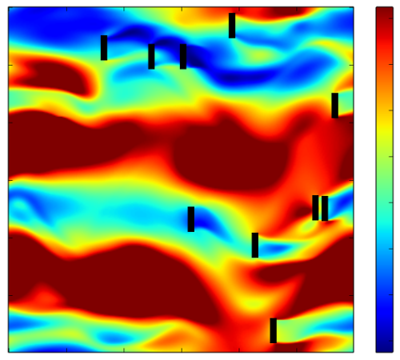

# 2D CFD 
## Solves the incompressible Euler equations.

The code solves the incompressible Euler equations. The code closely follows the derivation here:
http://www-math.mit.edu/cse/codes/mit18086_navierstokes.pdf

See an example image from the simulation below which approximates flow through a wind energy farm. The velocity is shown by the image's color: dark red is high velocity and dark blue is low velocity. The simulation was initialized with constant velocity from left to right and periodic boundary conditions (ie flow out of the right side of the domain re-entered the simulation on the left site). Each black line represents a model of a wind/ocean turbine using the actuator disk approximation. Behind the black line, you can see wakes forming where energy was removed from the fluid flow by the wind/ocean turbines.



## Running the code.

Running the code is as simple as:

```
# get the repository
git clone https://github.com/sAlexander/cfd.git

# compile all of the fortran
cd cfd/src
make

# run the code
./cfd
```

## Scripting with the code

A sample script has been added as `python/scripted.py`. This simple script will run a simple genetic algorithm in parallel -- parameters are explained in the file.

To run the script, the following will suffice:

```
# get the repository
git clone https://github.com/sAlexander/cfd.git

# compile all of the fortran
cd cfd/src
make

# move back up to the root directory
cd ..

# run the script
python python/scripted.py
```


